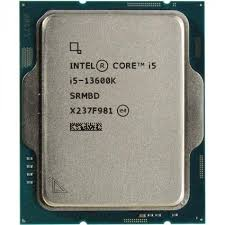
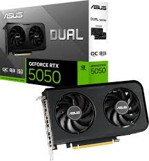
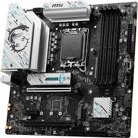
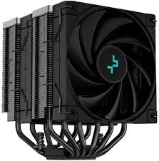
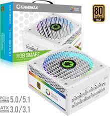
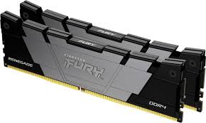
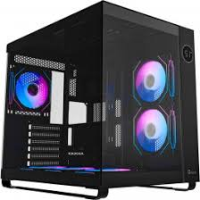
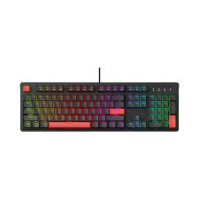
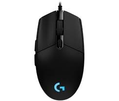
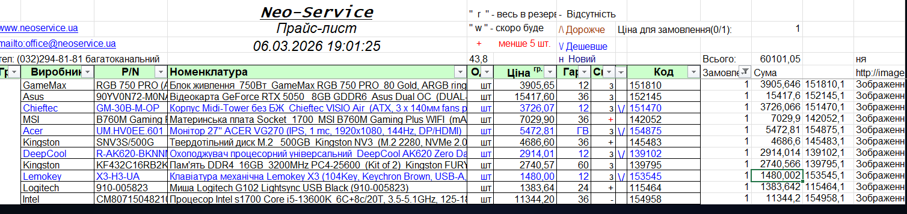

# 🚀 Технічна специфікація ігрової системи (60 101 грн)

Дана конфігурація розроблена для високопродуктивного геймінгу та обробки медіаданих. Всі компоненти підібрані з урахуванням сумісності шин передачі даних (PCIe 4.0) та теплового пакету (TDP).

## 📊 Зведена таблиця та бюджет

| Компонент | Модель | Специфікація | Ціна (грн) |
| :--- | :--- | :--- | :--- |
| **Процесор** | Intel Core i5-13600K | 14 ядер, 5.1GHz, 24MB L3 | 11 344.20 |
| **Відеокарта** | ASUS Dual RTX 5050 OC | 8GB GDDR6, 128-bit, DLSS 4.0 | 15 417.60 |
| **Материнська плата** | MSI B760M Gaming Plus WIFI | B760, LGA1700, Wi-Fi 6E, DDR4 | 7 029.90 |
| **Охолодження ЦП** | DeepCool AK620 Zero Dark | 260W TDP, Dual-Tower, 6 трубок | 2 914.01 |
| **Блок живлення** | GameMax RGB 750 PRO | 750W, 80+ Gold, ATX 3.1 | 3 905.65 |
| **Корпус** | Chieftec VISIO Air | Midi-Tower, 3x140mm fans, Mesh | 3 726.07 |
| **Оперативна пам'ять** | Kingston FURY Beast 16GB | 2x8GB DDR4, 3200MHz CL16 | 2 740.57 |
| **Накопичувач SSD** | Kingston NV3 500GB | NVMe PCIe 4.0 x4, 6000MB/s | 4 686.60 |
| **Монітор** | ACER Nitro VG270 | 27" IPS, 144Hz, 1ms, FreeSync | 5 472.81 |
| **Клавіатура** | Lemokey X3 (Keychron) | Mechanical Brown, QMK/VIA | 1 480.00 |
| **Мишка** | Logitech G102 Lightsync | 8000 DPI, 6 buttons, RGB | 1 383.64 |
| **ЗАГАЛЬНА СУМА** | | | **60 101.05** |

---

## 🔍 Детальні технічні характеристики

### 1. Процесор (CPU): Intel Core i5-13600K
* **Ядра:** 14 ядер (6 Performance-cores + 8 Efficient-cores).
* **Потоки:** 20 логічних потоків.
* **Частота:** Базова 3.5 ГГц, Turbo Boost Max 3.0 до 5.1 ГГц.
* **Техпроцес:** Intel 7 (10 нм).
* **Кеш:** 24 МБ Intel Smart Cache.
* **Енергоспоживання:** Base 125W, Max Turbo Power 181W.

### 2. Відеокарта (GPU): ASUS Dual GeForce RTX 5050 OC
* **Архітектура:** Blackwell (NVIDIA 50-серія).
* **Пам'ять:** 8 ГБ GDDR6, шина 128-біт.
* **Технології:** DLSS 4.0 (Frame Generation), Ray Tracing 4-го покоління, AV1 Encoder.
* **Охолодження:** Axial-tech вентилятори з подвійними кульковими підшипниками.

### 3. Материнська плата: MSI B760M Gaming Plus WIFI
* **Чипсет:** Intel B760.
* **Живлення:** 12+1+1 фазна система (VRM) з DrMOS.
* **Пам'ять:** 4 слоти DDR4 (до 128 ГБ, 5333+ МГц OC).
* **Інтерфейси:** 2x M.2 PCIe 4.0 x4, 4x SATA 6Gb/s.
* **Зв'язок:** Wi-Fi 6E, Bluetooth 5.3, Realtek 2.5Gbps LAN.

### 4. Охолодження: DeepCool AK620 Zero Dark
* **Конструкція:** Двосекційний радіатор, 6 мідних теплових трубок діаметром 6 мм.
* **Вентилятори:** 2 x 120 мм FDB (гідродинамічний підшипник), 500-1850 RPM.
* **Повітряний потік:** 68.99 CFM.
* **TDP:** До 260 Вт.

### 5. Блок живлення: GameMax RGB 750 PRO 80+ Gold
* **Сертифікація:** 80 PLUS Gold (ефективність >90%).
* **Модульність:** Повністю модульна система кабелів.
* **Стандарт:** ATX 3.1 / PCIe 5.1 (наявність 12V-2x6 конектора).
* **Охолодження:** 140-мм ARGB вентилятор з інтелектуальним керуванням обертами.

### 6. Оперативна пам'ять: Kingston FURY Beast DDR4
* **Об'єм:** 16 ГБ (Кіт 2x8 ГБ).
* **Частота:** 3200 МГц (PC4-25600).
* **Таймінги:** CL16-18-18 при напрузі 1.35V.
* **Профіль:** Підтримка Intel XMP 2.0.

### 7. Накопичувач: Kingston NV3 500GB SSD
* **Форм-фактор:** M.2 2280.
* **Протокол:** NVMe PCIe Gen 4.0 x4.
* **Швидкість:** Послідовне читання 6000 МБ/с, запис 4000 МБ/с.
* **Ресурс (TBW):** 160 ТБ.
![Kingston SSD][def]

### 8. Корпус: Chieftec VISIO Air
* **Формат:** Midi-Tower "Акваріум" (скляні панелі спереду та збоку).
* **Охолодження:** 3 передвстановлені 140-мм вентилятори.
* **Сумісність:** Підтримка відеокарт до 410 мм та кулерів до 175 мм.

---

## ⌨️ Периферія та Монітор

### 9. Монітор: ACER Nitro VG270
* **Діагональ/Матриця:** 27" IPS (ZeroFrame).
* **Роздільна здатність:** Full HD (1920 x 1080).
* **Герцовка:** 144 Гц (до 165 Гц OC).
* **Час відгуку:** 1 мс (VRB).
![Acer VG270][def2]

### 10. Клавіатура: Lemokey X3 (Mechanical)
* **Тип:** Механічна, Brown Switches (Keychron).
* **Особливості:** QMK/VIA (програмування клавіш), RGB-підсвітка, 1000 Гц частота опитування.

### 11. Мишка: Logitech G102 Lightsync
* **Сенсор:** Ігровий оптичний, 200-8000 DPI.
* **Кнопки:** 6 програмованих кнопок з пружинним механізмом натискання.

---

## 🧾 Розрахункова відомість (Excel)

Фінальний скріншот з Excel для підтвердження цін та сумісності:

---
*Конфігурацію складено: Березень 2026 року.*

[def]: images/ssd_kingston_nv3.jpg
[def2]: images/monitor_acer_vg270.jpg