# Тема 1-2. Апаратне забезпечення ПК

## 1. Правила електробезпеки та ESD

### Електробезпека
Робота з комп'ютерною технікою вимагає дотримання суворих правил для захисту людей і обладнання.
* **Висока напруга:** Блоки живлення та елементи лазерних принтерів містять конденсатори, що зберігають заряд високої напруги навіть після відключення від мережі. Не відкривайте їх корпуси.
* **Адаптери ноутбуків:** Використовуйте тільки оригінальні адаптери. Невідповідність напруги або сили струму може пошкодити ноутбук та батарею.
* **Заземлення:** Усе обладнання повинно бути заземленим (третій контакт у вилці). Це створює шлях найменшого опору для струму, захищаючи користувача у разі короткого замикання.

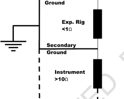

### Електростатичний розряд (ESD)
Статична електрика — головний ворог мікросхем.
* **Поріг відчуття:** Людина відчуває розряд при напрузі від **3000 В**.
* **Поріг пошкодження:** Комп'ютерні компоненти можуть вийти з ладу при розряді менше **30 В**.
* **Засоби захисту:**
    1.  **Антистатичний браслет:** З'єднує тіло майстра із заземленням (фарбованим корпусом), вирівнюючи потенціали.
    2.  **Антистатичний килимок:** Запобігає накопиченню заряду на столі.
    3.  **Антистатичні пакети:** Екранують компоненти під час зберігання.

---

## 2. Форм-фактори корпусів настільних комп'ютерів

Корпус (шасі) визначає розмір, тип материнської плати та організацію повітряних потоків (airlow) для охолодження.

| Форм-фактор | Характеристика | Призначення |
| :--- | :--- | :--- |
| **Горизонтальний (Horizontal)** | Розташовується на столі, монітор ставиться зверху. | Медіа-центри (HTPC), економія місця. |
| **Full-Size Tower** | Найбільший вертикальний корпус. Стоїть на підлозі. Має багато відсіків для дисків та гарну вентиляцію. | Сервери, ігрові станції, ентузіасти. |
| **Compact / Mini Tower** | Зменшена вежа (SFF). Займає мало місця, але має обмежені можливості апгрейду. | Офісні ПК, навчальні заклади. |
| **All-in-one (Моноблок)** | Системний блок інтегровано в корпус монітора. Важко модернізувати. | Офіси, домашнє використання (естетика). |

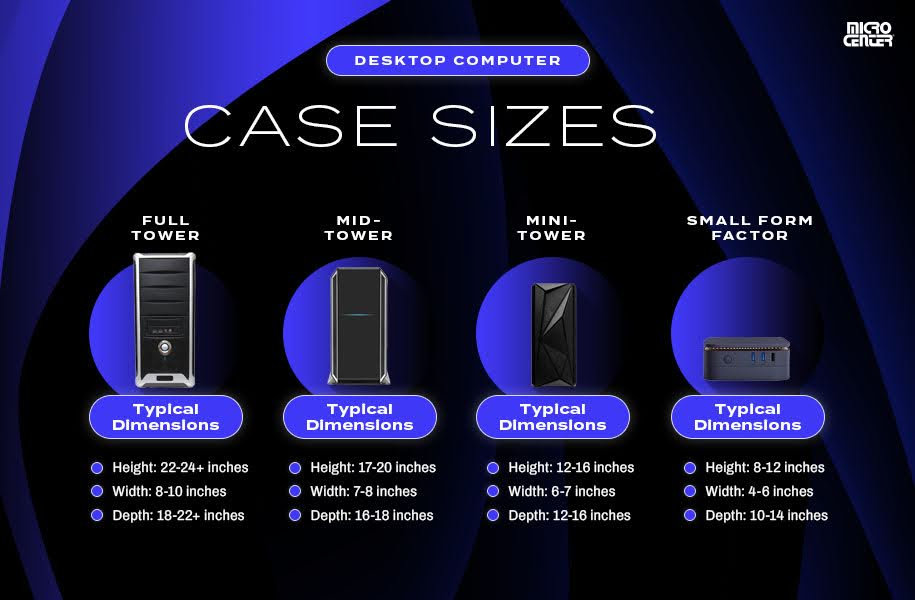

---

## 3. Блок живлення (PSU)

Блок живлення перетворює змінний струм (AC) 220В на постійний струм (DC) низької напруги.

### Ключові характеристики
* **Форм-фактор:** Найпоширеніший — **ATX12V** (для настільних ПК). Для серверів та потужних станцій — **EPS12V**.
* **Рівні напруги:**
    * **+3.3В та +5В:** Живлення чіпсету, оперативної пам'яті, логіки дисків.
    * **+12В:** Найважливіша лінія. Живить процесор, відеокарту, двигуни дисків та вентилятори.
* **Шини (Rails):** Single-rail (одна лінія +12В) або Multi-rail (декілька окремих ліній +12В для захисту від перевантаження).

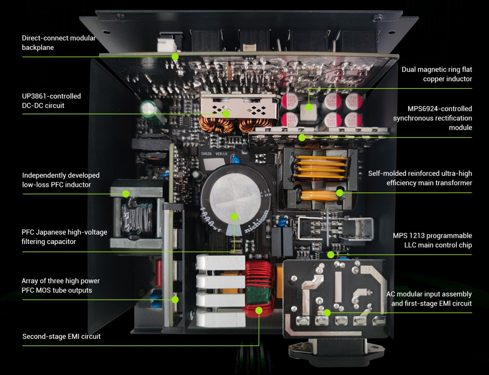

### Конектори блоку живлення

**1. Main Power (20/24-pin)**
Головний роз'єм живлення материнської плати. Має "ключ" (фіксатор) для правильного підключення. 24-пін версія сумісна з 20-пін платами (4 контакти відстібаються).
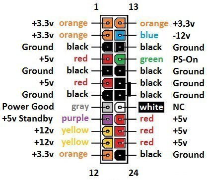

**2. SATA Power**
15-контактний плаский роз'єм для живлення SSD, HDD та оптичних приводів. Підтримує 3.3В, 5В, 12В.
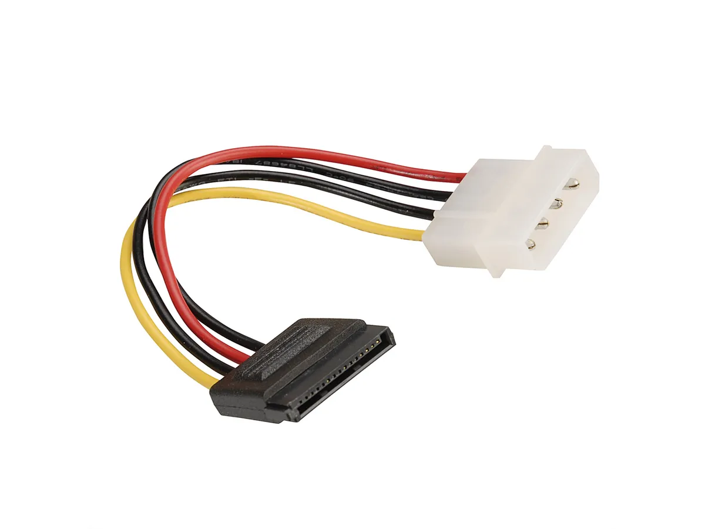

**3. Molex (4-pin)**
Старий стандарт (Peripheral). Використовується для старих HDD (PATA), корпусних вентиляторів та підсвітки. Тільки 5В і 12В.
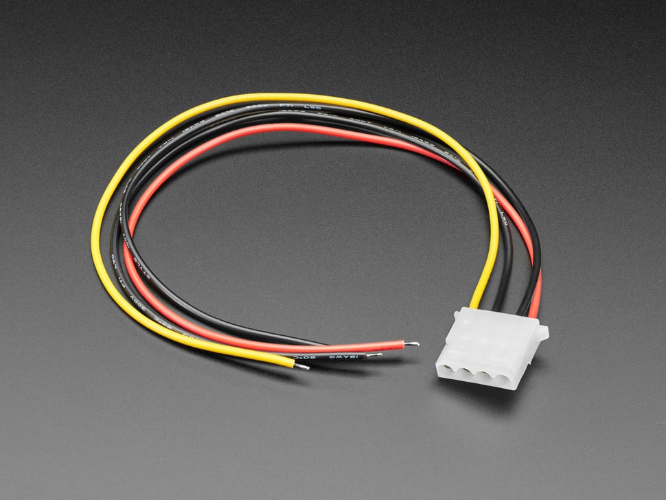

**4. Berg (4-pin)**
Маленький роз'єм для живлення флоппі-дисководів (FDD).
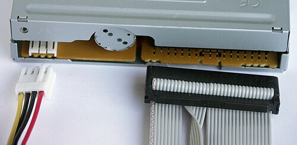

**5. CPU Power (4/8-pin)**
Додаткове живлення процесора. 8-пін конектор часто розділяється на дві частини (4+4) для сумісності.
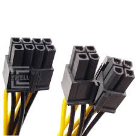

**6. PCIe Power (6/8-pin)**
Додаткове живлення для потужних відеокарт. 8-пін версія має конфігурацію 6+2.
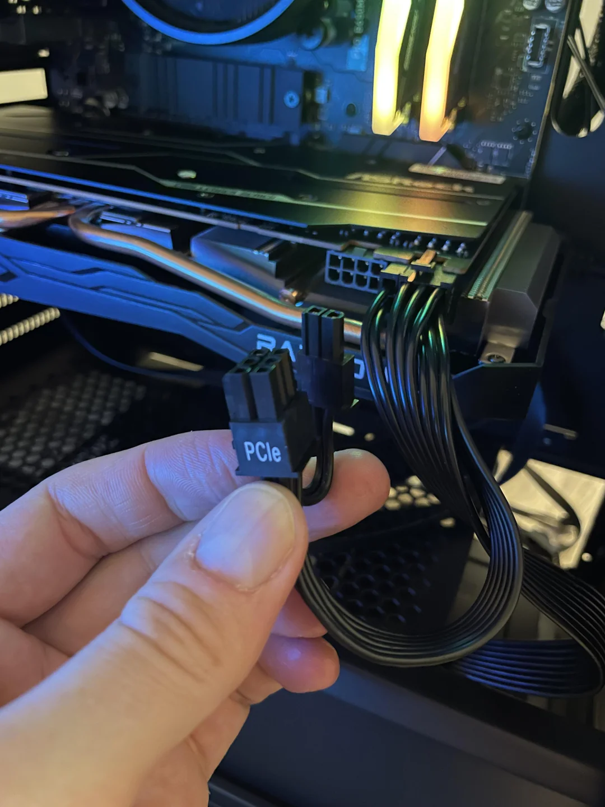

---

## 4. Основні компоненти материнської плати

Материнська плата (Motherboard) — багатошарова друкована плата (PCB), що з'єднує компоненти через провідні доріжки (шини).

### 1. Центральний процесор (CPU) та Сокет
**Сокет** — це гніздо для процесора. Існує два основних типи кріплення:
* **PGA (Pin Grid Array):** Ніжки (піни) розташовані на самому процесорі (поширено в AMD AM4).
* **LGA (Land Grid Array):** Ніжки розташовані у сокеті материнської плати, процесор має плоскі контакти (Intel, AMD AM5).
* **ZIF (Zero Insertion Force):** Механізм важеля, що фіксує процесор без зусиль.

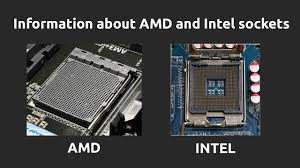

### 2. Оперативна пам'ять (RAM Slots)
Довгі слоти для модулів DIMM (Dual Inline Memory Module). Пам'ять є енергозалежною — дані зникають при вимкненні ПК. Слоти мають ключі (вирізи), щоб не вставити пам'ять іншого типу (DDR3 в DDR4).

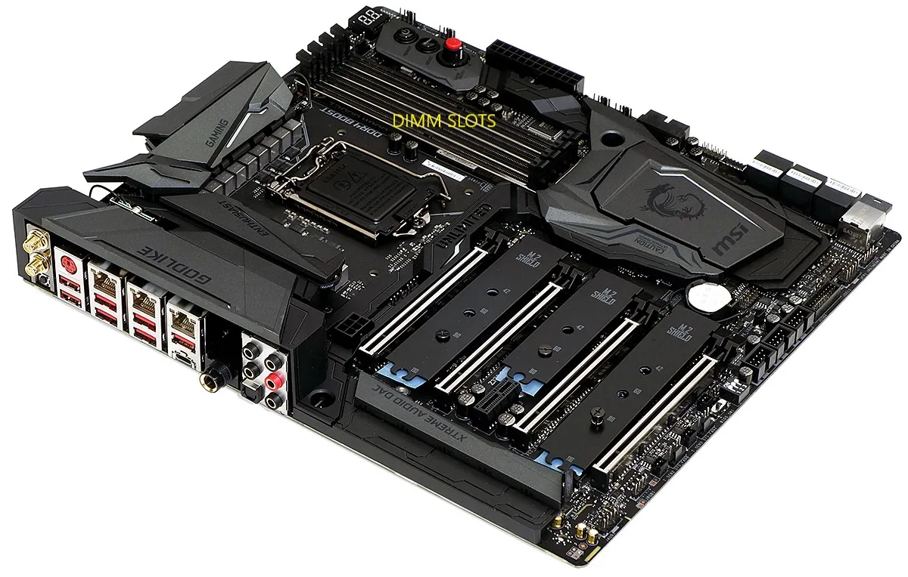

### 3. Слоти розширення (Expansion Slots)
Використовуються для встановлення карт розширення. Найпоширеніший стандарт — **PCIe (PCI Express)**:
* **x16:** Довгий слот для відеокарт.
* **x1:** Короткий слот для мережевих карт, звукових карт.

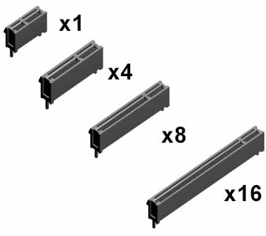

### 4. Чіпсет (Chipset)
"Світлофор" материнської плати. Набір мікросхем, що керує потоками даних.
* **Північний міст (Northbridge):** Відповідає за швидкісні канали: зв'язок CPU з ОЗП та відеокартою (у сучасних ПК часто інтегрований в CPU).
* **Південний міст (Southbridge):** Відповідає за "повільну" периферію: USB, SATA, BIOS, звук, мережа.

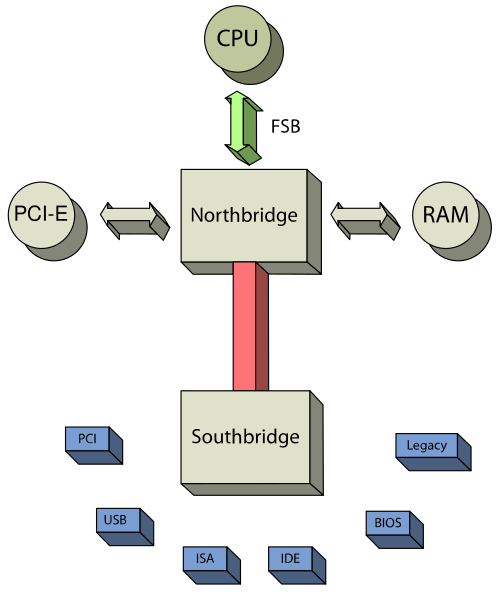

### 5. Мікросхема BIOS/UEFI
Енергонезалежна пам'ять (ROM), що зберігає мікропрограму для запуску ПК.
* **POST:** Самотестування апаратури при ввімкненні.
* **CMOS-батарейка:** Живить мікросхему пам'яті налаштувань (час, дата), коли ПК вимкнено з розетки.

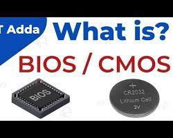

### 6. Інтерфейси накопичувачів
* **SATA (Serial ATA):** Г-подібний роз'єм для підключення SSD 2.5" та HDD 3.5".
* **M.2:** Сучасний слот на платі для встановлення швидкісних NVMe SSD (нагадує планку пам'яті).
* **IDE (PATA):** Застарілий широкий 40-піновий роз'єм.

### 7. Внутрішні роз'єми USB
Гребінки контактів (Headers) для підключення USB-портів на передній панелі корпусу.
* **USB 2.0:** 9 контактів (чорний колір).
* **USB 3.0:** 19 контактів (синій колір, ширший роз'єм).

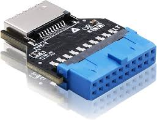