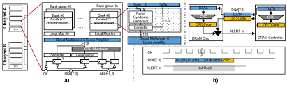
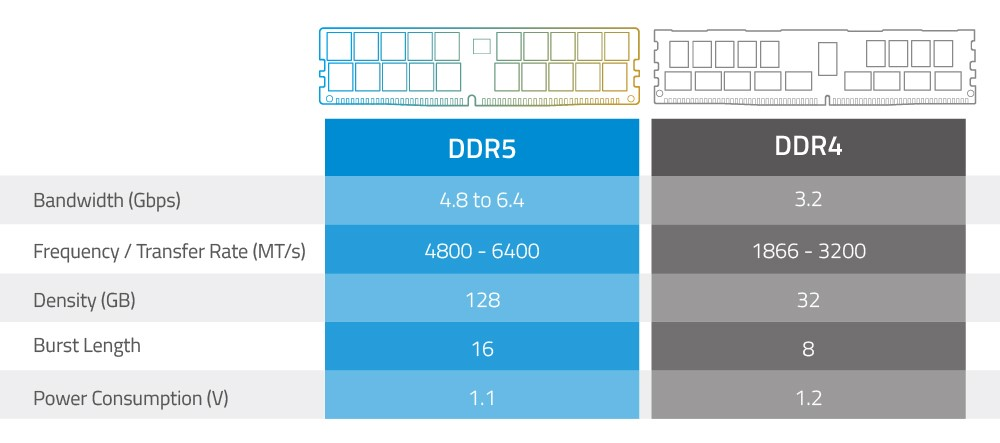
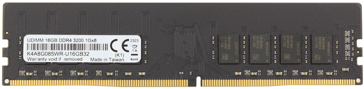
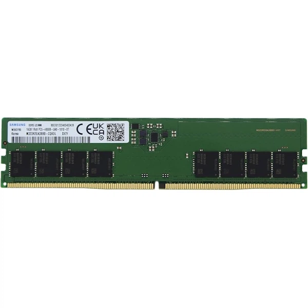

# Тема 3. Глибокий архітектурний аналіз та порівняння оперативної пам'яті DDR4 та DDR5

## 1. Еволюція стандартів: Архітектурна революція

Перехід з DDR4 на DDR5 — це не просто збільшення тактової частоти. Це фундаментальна зміна архітектури пам'яті, спрямована на вирішення проблеми "пляшкового горлечка" у багатоядерних процесорах. Зі зростанням кількості ядер у CPU (від 4 до 16 і більше) пропускної здатності DDR4 стало недостатньо для ефективного завантаження кожного ядра даними.

### Ключові архітектурні зміни

#### 1.1. Структура каналів (Sub-channels Architecture)
Це найважливіша зміна в архітектурі.
* **DDR4 (Один канал):** Стандартний модуль DDR4 має один 64-бітний канал даних. Коли процесор звертається до пам'яті, цей канал повністю займається однією операцією (читання або запис).
* **DDR5 (Два підканали):** Кожен модуль DDR5 фізично розділений на **два незалежних 32-бітних підканали**. Хоча сумарна ширина шини залишається 64 біти, це дозволяє контролеру пам'яті виконувати **дві операції одночасно** на одній планці. Це значно знижує затримки (latency) при доступі до даних у багатопотокових задачах.

#### 1.2. Керування живленням (PMIC - Power Management Integrated Circuit)
* **DDR4:** Перетворення напруги з 5В (від блоку живлення) у 1.2В (для чіпів пам'яті) відбувається на материнській платі. Це призводить до втрат енергії та "шумів" (перешкод) на шляху до слота пам'яті.
* **DDR5:** Контролер живлення (**PMIC**) перенесено безпосередньо на друковану плату самого модуля пам'яті. Це забезпечує:
    1.  Ідеальну стабільність напруги ("чисте" живлення).
    2.  Зменшення перешкод сигналу (Signal Integrity).
    3.  Зниження енергоспоживання (1.1В проти 1.2В).
    *Недолік:* Це ускладнює виробництво модуля і робить його дорожчим, а також призводить до сильнішого нагріву самої планки.

#### 1.3. Вбудована корекція помилок (On-die ECC)
Зі зменшенням техпроцесу (літографії) комірки пам'яті стають меншими, і ризик випадкової зміни біта (bit flip) зростає.
* **DDR5:** Кожен чіп пам'яті DDR5 має вбудовану систему корекції помилок (**On-die ECC**). Вона автоматично виправляє помилки всередині чіпа до того, як дані будуть відправлені процесору. Це критично для стабільності роботи системи на високих частотах (4800-8000 МГц).

#### 1.4. Довжина пакету (Burst Length) та Банки пам'яті
* **Burst Length (BL):** У DDR4 довжина пакету складала 8 (BL8), у DDR5 вона збільшена до 16 (BL16). Це означає, що за одну команду читання/запису DDR5 передає вдвічі більше корисної інформації.
* **Bank Groups:** Кількість груп банків у DDR5 подвоєна (8 груп проти 4 у DDR4). Це дозволяє контролеру тримати більше сторінок пам'яті відкритими одночасно, прискорюючи доступ до них.

#### 1.5. Візуальне порівняння (Фізичні відмінності)
Головна фізична відмінність — розташування ключа (вирізу) на контактах. У DDR5 він зміщений ближче до центру, тому модулі **не сумісні** між собою.

---

## 2. Детальний огляд та економічний аналіз обраних модулів Samsung

Для порівняння обрано модулі виробництва **Samsung** (OEM-серія). Це еталонні зразки індустрії, на базі яких створюються оверклокерські модулі інших брендів (G.Skill, Kingston, Corsair).

### Об'єкт 1: Samsung DDR4 16GB 3200MHz (M378A2G43AB3-CWE)
Класичний представник епохи DDR4. Використовує перевірену часом топологію.

* **Технічні характеристики:**
    * **Об'єм:** 16 ГБ
    * **Стандарт:** PC4-25600
    * **Ефективна частота:** 3200 МТ/с
    * **Таймінги (Latency):** CL22 (стандарт JEDEC)
    * **Напруга:** 1.2 В
* **Конструкція:** Текстоліт зеленого кольору, чіпи розташовані з одного або двох боків (залежно від ранговості). Відсутність радіаторів не є проблемою, оскільки DDR4 на напрузі 1.2В майже не гріється.
* **Ціна:** **4 836 ₴**
* **Посилання:** [Samsung DDR4 16GB на Rozetka](https://hard.rozetka.com.ua/ua/336338131/p336338131/)

### Об'єкт 2: Samsung DDR5 16GB 4800MHz (M378A2K43BB0)
Представник нового покоління. Візуально відрізняється наявністю додаткових компонентів на платі (PMIC та обв'язка).

* **Технічні характеристики:**
    * **Об'єм:** 16 ГБ
    * **Стандарт:** PC5-38400
    * **Ефективна частота:** 4800 МТ/с
    * **Таймінги (Latency):** CL40 (високі таймінги компенсуються величезною частотою та архітектурою підканалів)
    * **Напруга:** 1.1 В (основна), але модуль сам керує живленням.
* **Конструкція:** У центрі плати, між чіпами пам'яті, можна побачити мікросхему PMIC. Це "серце" модуля DDR5, яке відповідає за стабільність.
* **Ціна:** **7 775 ₴**
* **Посилання:** [Samsung DDR5 16GB на Rozetka](https://hard.rozetka.com.ua/ua/514054194/p514054194/)

---

## 3. Аналіз продуктивності та вартості

### 3.1. Розрахунок пропускної здатності
Пропускна здатність — це об'єм даних, який пам'ять може передати процесору за одну секунду.

| Тип пам'яті | Частота (МТ/с) | Ширина шини | Розрахунок | Пропускна здатність |
| :--- | :--- | :--- | :--- | :--- |
| **DDR4** | 3200 | 64 біт (8 байт) | 3200 × 8 | **25.6 ГБ/с** |
| **DDR5** | 4800 | 64 біт (8 байт) | 4800 × 8 | **38.4 ГБ/с** |

**Результат:** Перехід на DDR5 дає **50% приросту** швидкості передачі даних навіть на базовій частоті. У розгоні (6000+ МГц) ця різниця може досягати 100%.

### 3.2. Економічна доцільність
Порівняємо вартість одного гігабайта та вартість "швидкості".

* **Ціна DDR4:** 4 836 грн.
* **Ціна DDR5:** 7 775 грн.
* **Різниця:** Модуль DDR5 дорожчий на **2 939 грн** (або на **60.7%**).

**За що ми платимо ці 60% переплати?**
1.  **PMIC:** Вартість інтегрованого контролера живлення.
2.  **On-die ECC:** Вартість додаткової логіки корекції помилок у кожному чіпі.
3.  **Новизна:** DDR5 є новим стандартом, виробництво якого ще не досягло масштабів DDR4.
4.  **Продуктивність:** Приріст швидкодії у професійних задачах (архівація, рендеринг, компіляція коду) прямо пропорційний ціні.

---

## 4. Висновок

Вибір між DDR4 та DDR5 — це вибір між перевіреною економною класикою та перспективною технологією майбутнього.

1.  **DDR4 (Samsung 3200 МГц):** Ідеальний вибір для бюджетних та середніх ПК. Її швидкості достатньо для будь-яких сучасних ігор (де головну роль грає відеокарта), а ціна дозволяє заощадити значні кошти.
2.  **DDR5 (Samsung 4800 МГц):** Обов'язковий вибір для збірок на базі новітніх платформ (AM5, LGA1700/1851) вищого рівня. Вища пропускна здатність розкриває потенціал потужних процесорів, а архітектура з двома підканалами робить роботу системи більш "чутливою" у важких сценаріях. Переплата у 2939 грн є інвестицією в актуальність комп'ютера на наступні 5-7 років.