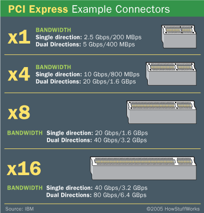
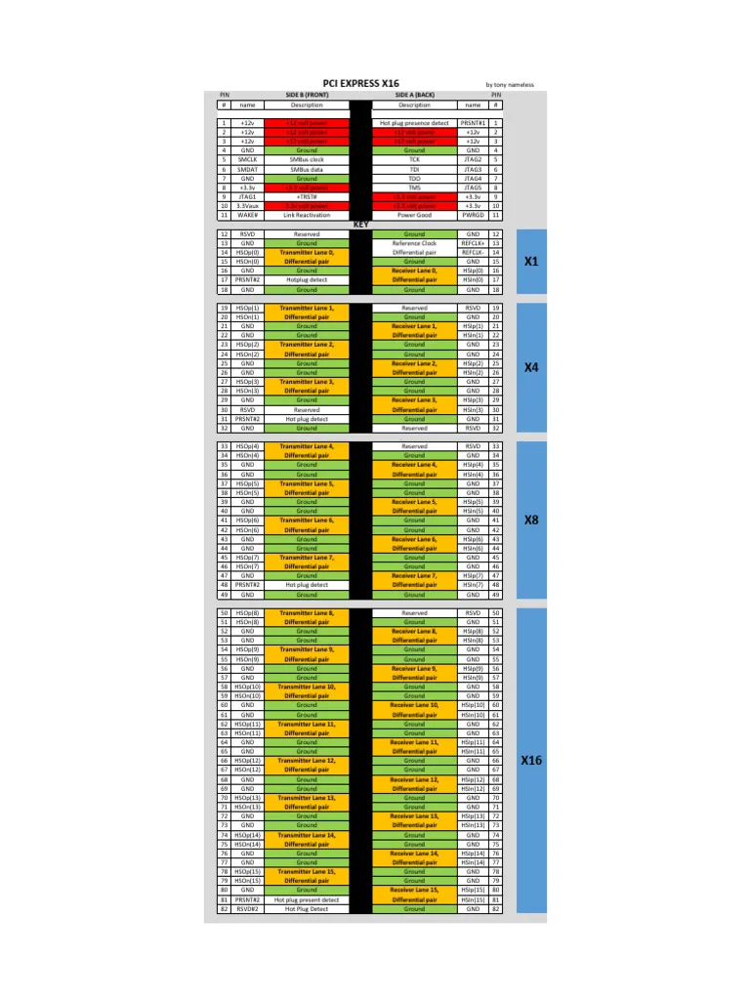
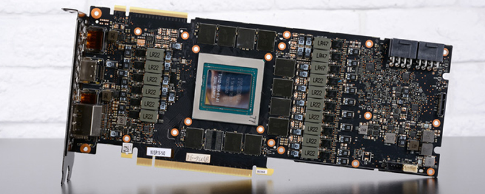
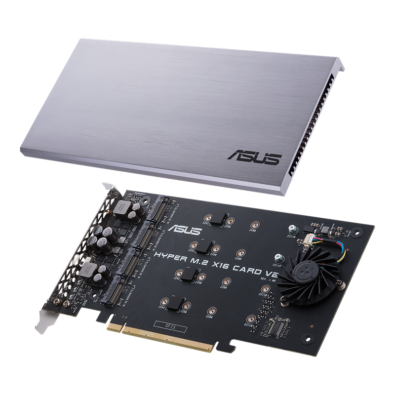
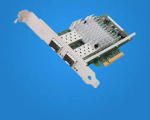
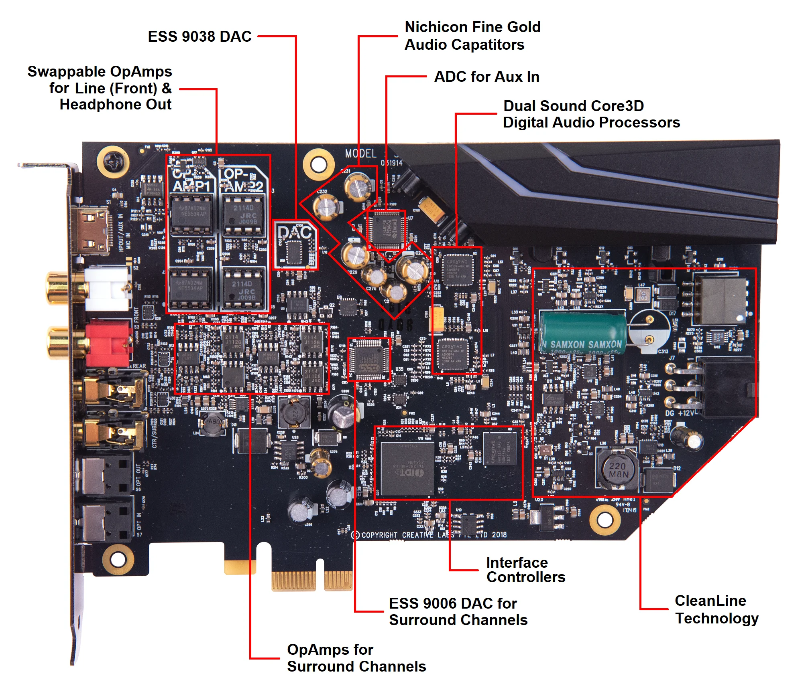
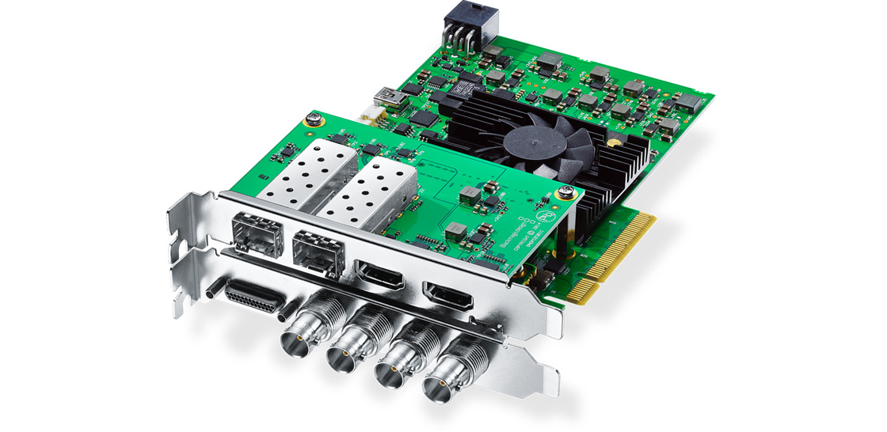
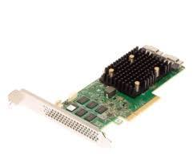
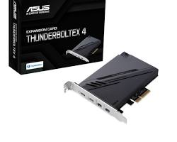

# Тема 4: Технічна специфікація інтерфейсів та карт розширення

## 1. Архітектура та характеристики слотів PCI Express

PCI Express (PCIe) — високошвидкісна послідовна шина вводу-виводу, що використовує диференціальну передачу сигналів.

### 1.1. Фізична та логічна організація
* **Диференціальна пара:** Базова одиниця передачі сигналу. Складається з двох провідників, сигнали в яких інверсні один до одного, що забезпечує високу завадостійкість.
* **Смуга (Lane):** Складається з 4 провідників (2 пари: RX для прийому, TX для передачі). Забезпечує повнодуплексний зв'язок (одночасна передача в обидві сторони).
* **Масштабованість:** Пропускна здатність лінійно залежить від кількості смуг.
    * **x1:** 18 контактів. Базовий канал.
    * **x4:** 32 контакти. Відкритий край дозволяє встановлення довших карт.
    * **x8:** 49 контактів. Часто використовується в серверних рішеннях.
    * **x16:** 82 контакти. Має фіксатор (retention latch) для утримання важких карт.

### 1.2. Пропускна здатність та кодування
Швидкість залежить від версії стандарту та схеми кодування, яка визначає накладні витрати (overhead).

| Версія | Рік | Кодування | Швидкість на лінію (ГТ/с) | Реальна швидкість (МБ/с) | x16 (ГБ/с) |
| :--- | :--- | :--- | :--- | :--- | :--- |
| **3.0** | 2010 | 128b/130b | 8.0 | ~985 | ~15.75 |
| **4.0** | 2017 | 128b/130b | 16.0 | ~1969 | ~31.51 |
| **5.0** | 2019 | 128b/130b | 32.0 | ~3938 | ~63.02 |

### 1.3. Електроживлення через слот
Стандартний слот PCIe забезпечує живлення карт напругою +12V та +3.3V.
* **x1:** до 10 Вт (без ініціалізації) / до 25 Вт (після конфігурації).
* **x16:** до 25 Вт (Low Profile) / до 75 Вт (Full Height).
Пристрої, що споживають >75 Вт, вимагають зовнішніх конекторів (6-pin/8-pin/12VHPWR).

---

## 2. Карти розширення інтерфейсу PCI-e (Детальний розбір)

### 1. Графічний прискорювач (Discrete GPU)
* **Інтерфейс:** PCIe x16 (електрично x16 або x8).
* **Архітектура:** Використовує масив шейдерних процесорів (CUDA/Stream Processors) для паралельних обчислень з плаваючою комою (FP32/FP64).
* **Пам'ять:** Власна VRAM (GDDR6/GDDR6X/HBM2) з широкою шиною (до 384 біт) для забезпечення пропускної здатності до 1 ТБ/с.
* **Особливості:** Підтримка апаратного трасування променів (RT Cores) та тензорних обчислень (AI/DLSS).

### 2. Адаптер-конвертер NVMe (M.2 to PCIe)
* **Інтерфейс:** PCIe x4.
* **Функція:** Маршрутизація ліній PCIe безпосередньо до роз'єму M.2 (ключ M).
* **Підтримка протоколів:** Тільки NVMe (AHCI/SATA M.2 диски не працюватимуть, оскільки вони використовують інший логічний інтерфейс).
* **Біфуркація (Bifurcation):** Для адаптерів на 2-4 диски материнська плата мусить підтримувати розділення слота (наприклад, x16 на x4/x4/x4/x4), інакше буде видно лише перший диск.

### 3. Мережевий контролер (NIC - Network Interface Card)
* **Інтерфейс:** PCIe x1 (1GbE), x4 (10GbE+).
* **Типи роз'ємів:** RJ45 (мідь) або SFP+ (оптоволокно/DAC).
* **Offloading:** Апаратне розвантаження CPU (TCP/IP Checksum Offload, RSS - Receive Side Scaling). Дозволяє обробляти гігабітні потоки без завантаження центрального процесора.
* **Контролери:** Intel X540/X550, Realtek, Broadcom.

### 4. Бездротовий модуль (Wi-Fi 6E / 7)
* **Інтерфейс:** PCIe x1.
* **Склад:** Плата-носій (Carrier Board) + модуль M.2 Key E (наприклад, Intel BE200).
* **Діапазони:** 2.4 GHz, 5 GHz, 6 GHz.
* **Bluetooth:** Реалізований через USB-протокол. Вимагає підключення кабелю до колодки F_USB на платі.
* **MIMO:** Підтримка технології MU-MIMO (Multi-User Multiple Input Multiple Output) для одночасної роботи з кількома клієнтами.

### 5. Аудіоінтерфейс (Sound Card)
* **Інтерфейс:** PCIe x1.
* **Компоненти:** ЦАП (DAC) високої розрядності (наприклад, ESS Sabre), АЦП (ADC) для запису, операційні підсилювачі (Op-Amps).
* **Характеристики:** SNR (співвідношення сигнал/шум) >120 дБ, THD (коефіцієнт гармонік) <0.0003%.
* **Ізоляція:** Використання окремих шарів PCB для аналогових та цифрових сигналів для уникнення інтерференції.

### 6. Плата відеозахоплення (Capture Card)
* **Інтерфейс:** PCIe x4 Gen 2/3.
* **Входи/Виходи:** HDMI або SDI. Функція Passthrough (наскрізна передача) для гри без затримок.
* **Колірний простір:** Підтримка RGB, YUY2, NV12. Професійні карти працюють з субдискретизацією 4:4:4 (без втрати кольору).
* **FPGA:** Часто використовують програмовані логічні матриці (Xilinx/Altera) для первинної обробки відеосигналу.

### 7. RAID/HBA Контролер (SAS/SATA)
* **Інтерфейс:** PCIe x8.
* **Режими роботи:**
    * **IT Mode (HBA):** Прямий доступ ОС до дисків (для ZFS, Software RAID).
    * **IR Mode (Hardware RAID):** Створення логічних томів (Virtual Drives) на рівні контролера (RAID 0, 1, 5, 6, 10).
* **Кеш-пам'ять:** DDR3/DDR4 DRAM на платі (до 4-8 ГБ) для прискорення запису. Захищається суперконденсатором (BBU) на випадок зникнення живлення.

### 8. Контролер периферії (USB 3.2 / Thunderbolt 4)
* **Інтерфейс:** PCIe x4.
* **Чипсет:** ASMedia, VIA або Intel (Maple Ridge).
* **Живлення:** Обов'язкове підключення SATA/Molex кабелю живлення для забезпечення стандарту USB PD (Power Delivery) до 100 Вт на порт.
* **Пропускна здатність:** Кожен порт може мати виділений канал або ділити загальну смугу PCIe. USB 3.2 Gen 2x2 забезпечує 20 Гбіт/с.
