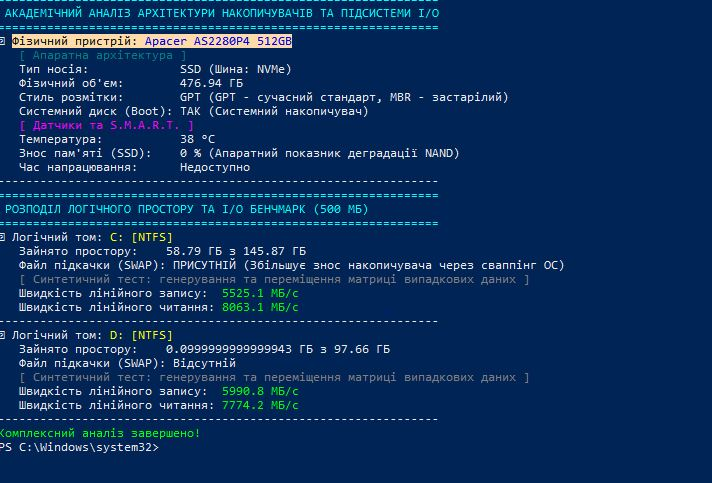
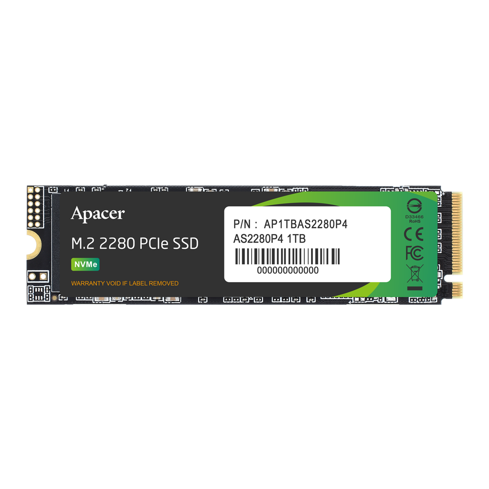

# Тема 5. Підсистема пам'яті: Типи, характеристики та глибокий аналіз SSD-накопичувачів

## 1. Типи, глибока архітектура та характеристики SSD-накопичувачів

Твердотільні накопичувачі (Solid-State Drives) — це складні електронні пристрої, які зберігають дані у масивах енергонезалежної флеш-пам'яті (NAND). На відміну від жорстких дисків (HDD), вони не мають рухомих механічних частин, що забезпечує мінімальні затримки (latency), надвисоку пропускну здатність та стійкість до фізичних пошкоджень.

### 1.1 Форм-фактори (Фізичні розміри)

З розвитком технологій мініатюризації накопичувачі еволюціонували від великих металевих блоків до розмірів планки оперативної пам'яті.

| Форм-фактор | Опис та підключення | Основне призначення | Сумісні інтерфейси |
| :--- | :--- | :--- | :--- |
| **2.5 дюйма** | Аналог класичного жорсткого диска. Підключається окремими кабелями живлення (SATA Power) та передачі даних (SATA Data). | Бюджетні ПК, оновлення старих ноутбуків, масиви файлових сховищ. | Тільки SATA III |
| **M.2 (2280 / 2242)** | Мініатюрна плата (ширина 22 мм, довжина зазвичай 80 мм або 42 мм). Вставляється безпосередньо у слот материнської плати. | Сучасні ПК, ультрабуки, ігрові консолі (PS5). | SATA III або NVMe (PCIe) |
| **mSATA** | Застаріла міні-плата, попередник M.2. | Старі ультрабуки (до 2015 року). | Тільки SATA III |
| **U.2 / U.3 (SFF-8639)** | Виглядає як товстий 2.5" диск, але з прямим підключенням до шини PCIe через спеціальний кабель. Підтримує гарячу заміну (Hot-Swap). | Серверні станції (Data Centers), корпоративний сегмент. | NVMe (PCIe) |
| **PCIe AIC (Add-In Card)** | Карта розширення, що встановлюється у слот PCIe x4/x8/x16, як відеокарта. Дозволяє встановлювати масивні радіатори. | Надпотужні робочі станції (HEDT). | NVMe (PCIe) |


### 1.2 Інтерфейси, протоколи та покоління PCIe

Швидкість накопичувача визначається протоколом обробки команд та пропускною здатністю фізичної шини. Сучасний стандарт для ентузіастів та геймерів — це робота через лінії PCI Express (PCIe).

| Інтерфейс / Шина | Протокол | Теоретична швидкість (лінійне читання) | Особливості обробки команд та архітектури |
| :--- | :--- | :--- | :--- |
| **SATA III** | AHCI | ~600 МБ/с | 1 черга на 32 команди. Створений для механічних дисків, фізично обмежує швидкість флеш-пам'яті. |
| **PCIe 3.0 x4** | NVMe | ~3 500 МБ/с | 64 000 черг по 64 000 команд. Дозволяє паралельну обробку запитів багатоядерними процесорами. |
| **PCIe 4.0 x4** | NVMe | ~7 500 МБ/с | Поточний стандарт. Повністю розкриває потенціал технології **Microsoft DirectStorage**. |
| **PCIe 5.0 x4** | NVMe | ~14 000+ МБ/с | Надвисокі швидкості. Вимагає обов'язкового активного охолодження через високе тепловиділення. |

**Технологія DirectStorage:** Інноваційний API, який дозволяє NVMe-накопичувачу передавати стиснені текстури ігор чи важкі масиви даних напряму у відеопам'ять (VRAM) відеокарти, оминаючи центральний процесор (CPU). Це позбавляє систему від "пляшкових горлечок" і забезпечує миттєве завантаження відкритих ігрових світів.


### 1.3 Архітектура кристалів пам'яті (NAND Flash) та 3D компонування

Дані зберігаються у мікроскопічних комірках (транзисторах із плаваючим затвором) шляхом зміни рівня напруги.

| Тип NAND | Бітів на комірку | Гарантований ресурс (циклів) | Швидкість читання/запису | Цільове призначення |
| :--- | :---: | :--- | :--- | :--- |
| **SLC (Single-Level)** | 1 | ~100 000 | Максимальна (розрізняє лише 2 рівні напруги) | Кешування, сервери баз даних, військова техніка |
| **MLC (Multi-Level)** | 2 | ~3 000 – 10 000 | Висока (4 рівні напруги) | Професійні робочі станції |
| **TLC (Triple-Level)** | 3 | ~1 000 – 3 000 | Середня (8 рівнів напруги) | Масові ПК, геймінг, ноутбуки |
| **QLC (Quad-Level)** | 4 | ~100 – 1 000 | Низька (16 рівнів напруги) | Бюджетні файлові сховища, заміна HDD |

**Еволюція 3D NAND:** Оскільки нескінченно зменшувати розмір транзисторів неможливо через фізичні витоки струму, інженери почали розташовувати комірки вертикально, шар за шаром. Сучасні SSD використовують 176-, 232- або навіть 300+ шарові кристали 3D NAND. Це різко збільшує щільність даних та знижує взаємні перешкоди між комірками.


### 1.4 Архітектура контролера та кешування даних

SSD — це мінікомп'ютер. Його "мозком" є **мікроконтролер** (зазвичай багатоядерний ARM-процесор), який керує потоками даних, складною математичною корекцією помилок (LDPC) та шифруванням.
* **DRAM-кеш (Апаратний буфер):** Топові моделі SSD мають розпаяну на платі мікросхему швидкої оперативної пам'яті (DDR4/DDR5). Вона зберігає таблицю трансляції адрес (FTL) — "карту", яка вказує, де фізично лежить кожен файл. Це радикально прискорює пошук дрібних файлів.
* **HMB (Host Memory Buffer):** Технологія для дешевших SSD (DRAM-less), які не мають власного чипа пам'яті. Через шину PCIe вони "відбирають" 16-64 МБ від оперативної пам'яті комп'ютера (RAM) для зберігання своїх таблиць маршрутизації.
* **Псевдо-SLC кешування:** Для компенсації повільної фізичної швидкості пам'яті TLC/QLC, контролер виділяє частину вільного простору і записує туди дані лише по 1 біту (емулюючи надшвидку пам'ять SLC). Це дає пікову швидкість на старті копіювання файлу, яка може впасти, коли цей "віртуальний кеш" переповниться.

### 1.5 Головні метрики, надійність та безпека
* **TBW (Total Bytes Written):** Гарантійний обсяг даних (у терабайтах), який можна записати на диск до початку фізичної деградації комірок. Наприклад, показник 600 TBW для диска на 1 ТБ означає, що його можна повністю перезаписувати від нуля до максимуму понад 600 разів.
* **Thermal Throttling (Тепловий тротлінг):** Захисний механізм від перегріву. Якщо температура контролера перетинає ліміт (зазвичай ~75°C), він примусово знижує швидкість роботи, щоб уникнути пошкодження пристрою.
* **Wear Leveling (Вирівнювання зносу):** Алгоритм, за яким контролер непомітно переміщує "статичні" файли (наприклад, файли операційної системи), щоб рівномірно зношувати абсолютно всі комірки кристала пам'яті.
* **Garbage Collection та TRIM:** Оскільки флеш-пам'ять не може просто "перезаписати" дані (вона повинна спочатку фізично стерти цілий блок комірок), команда ОС **TRIM** повідомляє диску, які файли були видалені в Кошик. Після цього апаратний "збирач сміття" (Garbage Collection) заздалегідь стирає ці блоки у фоновому режимі.
* **Апаратне шифрування (TCG Opal 2.0 / AES-256):** Сучасні контролери здатні шифрувати всі дані "на льоту" ресурсами самого накопичувача без навантаження на центральний процесор комп'ютера.


# ПРАКТИЧНА ЧАСТИНА: Аналіз підсистеми I/O та встановленого накопичувача

Для збору детальної технічної інформації про накопичувач, встановлений на ПК, було розроблено та виконано скрипт на базі Windows PowerShell.

# ВИКОНАННЯ СКРИПТА

### Розшифровка та аналіз отриманих даних
* **Апаратна база:** У системі встановлено M.2 накопичувач Apacer AS2280P4 із заявленим об'ємом 512 ГБ. Працює на швидкісній шині NVMe. Доступний (корисний) об'єм становить 476.94 ГБ.
* **Стиль розмітки:** Накопичувач ініціалізовано у сучасному стилі GPT (GUID Partition Table). Він є завантажувальним (Boot: ТАК), містить операційну систему.
* **Показники датчиків S.M.A.R.T.:** Температура контролера становить 38 °C. Це ідеальний тепловий режим, що гарантує відсутність теплового тротлінгу. Апаратний знос пам'яті фіксується на рівні 0 %, пристрій зберіг повний запас гарантійного ресурсу.
* **Логічний розподіл:** Простір розділено на два томи (C: та D:), відформатовані в NTFS. На системному диску C: розміщено файл підкачки (SWAP). Том D: наразі майже порожній.
* **Продуктивність I/O (Бенчмарк):** Синтетичний тест показав надзвичайно високі результати: лінійний запис 5525 – 5990 МБ/с, лінійне читання сягає 7774 – 8063 МБ/с. Це пояснюється інтеграцією дискової підсистеми з кешем RAM та паралельною обробкою команд шини PCIe.

###  Загальний висновок
Накопичувач Apacer AS2280P4 (512GB) знаходиться у відмінному технічному стані. Відсутність апаратного зносу (0%) свідчить про стан нового пристрою. Температурний режим (38 °C) є безпечним та ефективним. Використання шини NVMe та розмітки GPT забезпечують високу швидкість обміну даними, гарантуючи швидке завантаження ОС та стабільну роботу системи.

### 2.4 Загальний висновок
Накопичувач Apacer AS2280P4 (512GB) знаходиться у відмінному технічному стані. Відсутність апаратного зносу (0%) свідчить про стан нового пристрою. Температурний режим (38 °C) є безпечним та ефективним. Використання шини NVMe та розмітки GPT забезпечують високу швидкість обміну даними, гарантуючи швидке завантаження ОС та стабільну роботу системи.

**Результат виконання скрипта та фізичний вигляд накопичувача:**




## Код програми (PowerShell Script)

```powershell
Clear-Host
Write-Host "===============================================================" -ForegroundColor Cyan
Write-Host " АКАДЕМІЧНИЙ АНАЛІЗ АРХІТЕКТУРИ НАКОПИЧУВАЧІВ ТА ПІДСИСТЕМИ I/O" -ForegroundColor Cyan
Write-Host "===============================================================" -ForegroundColor Cyan

$isAdmin = ([Security.Principal.WindowsPrincipal][Security.Principal.WindowsIdentity]::GetCurrent()).IsInRole([Security.Principal.WindowsBuiltInRole]::Administrator)
if (!$isAdmin) {
    Write-Host "[!] Запустіть скрипт від імені Адміністратора для отримання повних даних!" -ForegroundColor Red
}

$Disks = Get-PhysicalDisk | Sort-Object DeviceId
$LogicalDisks = Get-CimInstance Win32_LogicalDisk | Where-Object DriveType -eq 3
$PageFiles = Get-CimInstance Win32_PageFileUsage -ErrorAction SilentlyContinue

foreach ($Disk in $Disks) {
    $Smart = $Disk | Get-StorageReliabilityCounter -ErrorAction SilentlyContinue
    $StorageDisk = Get-Disk -Number $Disk.DeviceId -ErrorAction SilentlyContinue

    Write-Host "➔ Фізичний пристрій: " -NoNewline; Write-Host "$($Disk.FriendlyName)" -ForegroundColor Yellow
    
    Write-Host "   [ Апаратна архітектура ]" -ForegroundColor DarkCyan
    Write-Host "   Тип носія:             $($Disk.MediaType) (Шина: $($Disk.BusType))"
    $CapacityGB = [math]::Round($Disk.Size / 1GB, 2)
    Write-Host "   Фізичний об'єм:        $CapacityGB ГБ"
    
    $PartitionStyle = if ($null -ne $StorageDisk.PartitionStyle) { $StorageDisk.PartitionStyle } else { "Невідомо" }
    $IsBoot = if ($null -ne $StorageDisk -and $StorageDisk.IsBoot) { "ТАК (Системний накопичувач)" } else { "НІ" }
    Write-Host "   Стиль розмітки:        $PartitionStyle (GPT - сучасний стандарт, MBR - застарілий)"
    Write-Host "   Системний диск (Boot): $IsBoot"

    Write-Host "   [ Датчики та S.M.A.R.T. ]" -ForegroundColor Magenta
    $Temp = if ($null -ne $Smart.Temperature) { "$($Smart.Temperature) °C" } else { "Недоступно" }
    $Wear = if ($null -ne $Smart.Wear) { "$($Smart.Wear) %" } else { "Недоступно" }
    $Hours = if ($null -ne $Smart.PowerOnHours) { "$($Smart.PowerOnHours) годин" } else { "Недоступно" }
    
    Write-Host "   Температура:           $Temp"
    Write-Host "   Знос пам'яті (SSD):    $Wear % (Апаратний показник деградації NAND)"
    Write-Host "   Час напрацювання:      $Hours"
    Write-Host "---------------------------------------------------------------"
}

Write-Host "===============================================================" -ForegroundColor Cyan
Write-Host " РОЗПОДІЛ ЛОГІЧНОГО ПРОСТОРУ ТА I/O БЕНЧМАРК (500 МБ)          " -ForegroundColor Cyan
Write-Host "===============================================================" -ForegroundColor Cyan

foreach ($Vol in $LogicalDisks) {
    $TotalGB = [math]::Round($Vol.Size / 1GB, 2)
    $FreeGB  = [math]::Round($Vol.FreeSpace / 1GB, 2)
    $UsedGB  = [math]::Round($TotalGB - $FreeGB, 2)
    
    $HasPageFile = if ($null -ne $PageFiles -and $PageFiles.Name -match "^$($Vol.DeviceID)") { 
        "ПРИСУТНІЙ (Збільшує знос накопичувача через сваппінг ОС)" 
    } else { 
        "Відсутній" 
    }

    Write-Host "➔ Логічний том: " -NoNewline; Write-Host "$($Vol.DeviceID) [$($Vol.FileSystem)]" -ForegroundColor Yellow
    Write-Host "   Зайнято простору:    $UsedGB ГБ з $TotalGB ГБ"
    Write-Host "   Файл підкачки (SWAP): $HasPageFile"
    
    $TestPath = "$($Vol.DeviceID)\io_speed_test.dat"
    Write-Host "   [ Синтетичний тест: генерування та переміщення матриці випадкових даних ]" -ForegroundColor DarkGray
    
    try {
        $Buffer = New-Object byte[] 1048576 
        (New-Object Random).NextBytes($Buffer) 
        
        Write-Host "   Швидкість лінійного запису:  " -NoNewline
        $File = [System.IO.File]::Create($TestPath)
        $SW = [System.Diagnostics.Stopwatch]::StartNew()
        for ($i = 0; $i -lt 500; $i++) { $File.Write($Buffer, 0, $Buffer.Length) }
        $SW.Stop()
        $File.Close()
        
        $WriteSpeed = [math]::Round((500 / $SW.Elapsed.TotalSeconds), 1)
        Write-Host "$WriteSpeed МБ/с" -ForegroundColor Green
        
        Write-Host "   Швидкість лінійного читання: " -NoNewline
        $SW.Restart()
        $File = [System.IO.File]::OpenRead($TestPath)
        while ($File.Read($Buffer, 0, $Buffer.Length) -gt 0) { }
        $SW.Stop()
        $File.Close()
        
        $ReadSpeed = [math]::Round((500 / $SW.Elapsed.TotalSeconds), 1)
        Write-Host "$ReadSpeed МБ/с" -ForegroundColor Green
        
        Remove-Item $TestPath -ErrorAction SilentlyContinue
    } catch {
        Write-Host "Бракує прав доступу." -ForegroundColor Red
        if (Test-Path $TestPath) { Remove-Item $TestPath -ErrorAction SilentlyContinue }
    }
    Write-Host "---------------------------------------------------------------"
}
