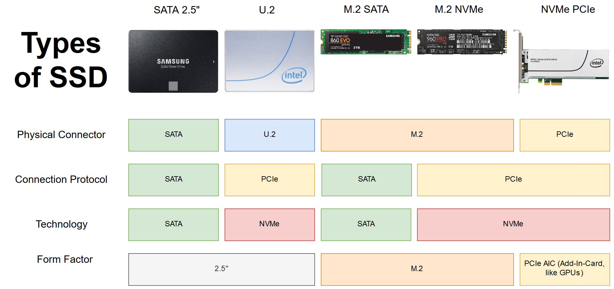
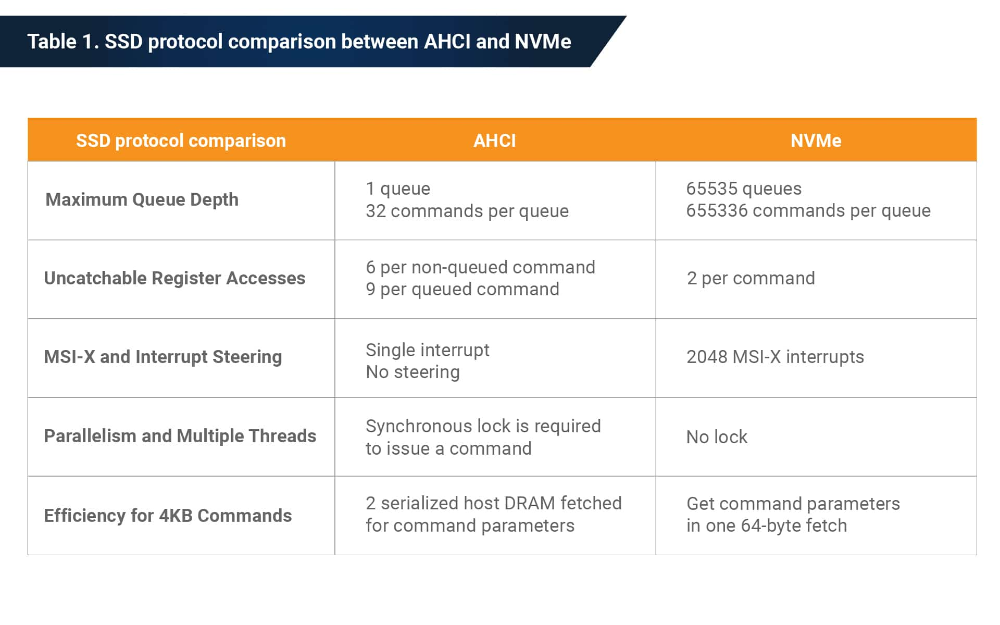
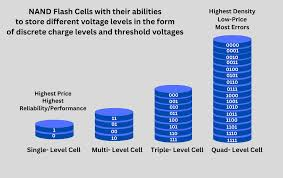
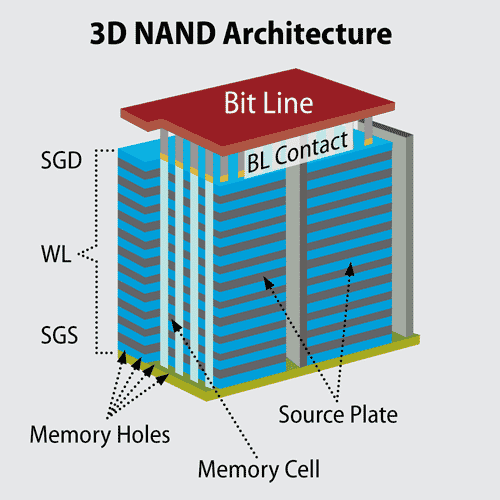

# Тема 5. Підсистема пам'яті: Типи, характеристики та глибокий аналіз SSD-накопичувачів


## 1. Глибинна архітектура, типи та характеристики SSD

Твердотільні накопичувачі (Solid-State Drives) — це складні обчислювальні пристрої, які зберігають дані у мікросхемах флеш-пам'яті (NAND). 

### 1.1 Форм-фактори (Фізичні розміри)

| Форм-фактор | Зовнішній вигляд та підключення | Основний сегмент використання | Сумісні інтерфейси |
| :--- | :--- | :--- | :--- |
| **2.5 дюйма** | Аналог жорсткого диска ноутбука. | Оновлення старих ПК та ноутбуків. | Тільки SATA III |
| **mSATA** | Застаріла міні-плата. | Старі ультрабуки (до епохи M.2). | Тільки SATA III |
| **M.2 (2280)** | Компактна плата (ширина 22 мм, довжина 80 мм). | Сучасні ПК, ноутбуки, консолі. | SATA III або NVMe (PCIe) |
| **U.2 / U.3** | Товстий 2.5" диск з підключенням до PCIe. | Серверні станції (Data Centers). | NVMe (PCIe) |
| **PCIe AIC** | Карта розширення (як відеокарта). | Надпотужні робочі станції. | NVMe (PCIe) |



### 1.2 Інтерфейси, протоколи та лінії PCIe

| Інтерфейс / Шина | Протокол | Максимальна швидкість | Особливості обробки команд (Черги) |
| :--- | :--- | :--- | :--- |
| **SATA III** | AHCI | ~600 МБ/с | 1 черга на 32 команди (Створює затримки) |
| **PCIe 3.0 x4** | NVMe | ~3 500 МБ/с | 64 000 черг по 64 000 команд (Паралельна обробка) |
| **PCIe 4.0 x4** | NVMe | ~7 500 МБ/с | 64 000 черг по 64 000 команд |



### 1.3 Архітектура кристалів пам'яті (NAND Flash)

| Тип NAND | Бітів на комірку | Ресурс (циклів) | Швидкість | Цільове призначення |
| :--- | :---: | :--- | :--- | :--- |
| **SLC** | 1 | ~100 000 | Максимальна | Сервери баз даних, ВПК |
| **MLC** | 2 | ~3 000 – 10 000 | Висока | Професійні робочі станції |
| **TLC** | 3 | ~1 000 – 3 000 | Середня | Масові ПК, геймінг |
| **QLC** | 4 | ~100 – 1 000 | Низька | Бюджетні файлові сховища |




### 1.4 Головні метрики та технології
* **TBW (Total Bytes Written):** Гарантійний обсяг даних (у терабайтах), який можна записати на диск до початку фізичної деградації комірок.
* **Wear Leveling (Вирівнювання зносу):** Мікроконтролер примусово перетасовує статичні файли, гарантуючи рівномірний знос усього кристала пам'яті.
* **Garbage Collection та TRIM:** ОС через команду TRIM повідомляє диску, які файли були видалені, а "збирач сміття" у фоновому режимі стирає ці блоки.


---

## 2. Практична частина: Аналіз підсистеми I/O встановленого накопичувача

Для збору технічної інформації про накопичувач було розроблено академічний скрипт на базі Windows PowerShell, який зчитує апаратну архітектуру, телеметрію S.M.A.R.T. та проводить бенчмарк швидкості.

### 2.1 Код програми (PowerShell Script)

```powershell
Clear-Host
Write-Host "===============================================================" -ForegroundColor Cyan
Write-Host " АКАДЕМІЧНИЙ АНАЛІЗ АРХІТЕКТУРИ НАКОПИЧУВАЧІВ ТА ПІДСИСТЕМИ I/O" -ForegroundColor Cyan
Write-Host "===============================================================" -ForegroundColor Cyan

$isAdmin = ([Security.Principal.WindowsPrincipal][Security.Principal.WindowsIdentity]::GetCurrent()).IsInRole([Security.Principal.WindowsBuiltInRole]::Administrator)
if (!$isAdmin) {
    Write-Host "[!] Запустіть скрипт від імені Адміністратора!" -ForegroundColor Red
}

$Disks = Get-PhysicalDisk | Sort-Object DeviceId
$LogicalDisks = Get-CimInstance Win32_LogicalDisk | Where-Object DriveType -eq 3
$PageFiles = Get-CimInstance Win32_PageFileUsage -ErrorAction SilentlyContinue

foreach ($Disk in $Disks) {
    $Smart = $Disk | Get-StorageReliabilityCounter -ErrorAction SilentlyContinue
    $StorageDisk = Get-Disk -Number $Disk.DeviceId -ErrorAction SilentlyContinue

    Write-Host "➔ Фізичний пристрій: " -NoNewline; Write-Host "$($Disk.FriendlyName)" -ForegroundColor Yellow
    
    Write-Host "   [ Апаратна архітектура ]" -ForegroundColor DarkCyan
    Write-Host "   Тип носія:             $($Disk.MediaType) (Шина: $($Disk.BusType))"
    $CapacityGB = [math]::Round($Disk.Size / 1GB, 2)
    Write-Host "   Фізичний об'єм:        $CapacityGB ГБ"
    
    $PartitionStyle = if ($null -ne $StorageDisk.PartitionStyle) { $StorageDisk.PartitionStyle } else { "Невідомо" }
    $IsBoot = if ($null -ne $StorageDisk -and $StorageDisk.IsBoot) { "ТАК (Системний накопичувач)" } else { "НІ" }
    Write-Host "   Стиль розмітки:        $PartitionStyle (GPT - сучасний стандарт, MBR - застарілий)"
    Write-Host "   Системний диск (Boot): $IsBoot"

    Write-Host "   [ Датчики та S.M.A.R.T. ]" -ForegroundColor Magenta
    $Temp = if ($null -ne $Smart.Temperature) { "$($Smart.Temperature) °C" } else { "Недоступно" }
    $Wear = if ($null -ne $Smart.Wear) { "$($Smart.Wear) %" } else { "Недоступно" }
    $Hours = if ($null -ne $Smart.PowerOnHours) { "$($Smart.PowerOnHours) годин" } else { "Недоступно" }
    
    Write-Host "   Температура:           $Temp"
    Write-Host "   Знос пам'яті (SSD):    $Wear % (Апаратний показник деградації NAND)"
    Write-Host "   Час напрацювання:      $Hours"
    Write-Host "---------------------------------------------------------------"
}

Write-Host "===============================================================" -ForegroundColor Cyan
Write-Host " РОЗПОДІЛ ЛОГІЧНОГО ПРОСТОРУ ТА I/O БЕНЧМАРК (500 МБ)          " -ForegroundColor Cyan
Write-Host "===============================================================" -ForegroundColor Cyan

foreach ($Vol in $LogicalDisks) {
    $TotalGB = [math]::Round($Vol.Size / 1GB, 2)
    $FreeGB  = [math]::Round($Vol.FreeSpace / 1GB, 2)
    $UsedGB  = [math]::Round($TotalGB - $FreeGB, 2)
    
    $HasPageFile = if ($null -ne $PageFiles -and $PageFiles.Name -match "^$($Vol.DeviceID)") { 
        "ПРИСУТНІЙ (Збільшує знос накопичувача через сваппінг ОС)" 
    } else { 
        "Відсутній" 
    }

    Write-Host "➔ Логічний том: " -NoNewline; Write-Host "$($Vol.DeviceID) [$($Vol.FileSystem)]" -ForegroundColor Yellow
    Write-Host "   Зайнято простору:    $UsedGB ГБ з $TotalGB ГБ"
    Write-Host "   Файл підкачки (SWAP): $HasPageFile"
    
    $TestPath = "$($Vol.DeviceID)\io_speed_test.dat"
    Write-Host "   [ Синтетичний тест: генерування та переміщення матриці випадкових даних ]" -ForegroundColor DarkGray
    
    try {
        $Buffer = New-Object byte[] 1048576 
        (New-Object Random).NextBytes($Buffer) 
        
        Write-Host "   Швидкість лінійного запису:  " -NoNewline
        $File = [System.IO.File]::Create($TestPath)
        $SW = [System.Diagnostics.Stopwatch]::StartNew()
        for ($i = 0; $i -lt 500; $i++) { $File.Write($Buffer, 0, $Buffer.Length) }
        $SW.Stop()
        $File.Close()
        
        $WriteSpeed = [math]::Round((500 / $SW.Elapsed.TotalSeconds), 1)
        Write-Host "$WriteSpeed МБ/с" -ForegroundColor Green
        
        Write-Host "   Швидкість лінійного читання: " -NoNewline
        $SW.Restart()
        $File = [System.IO.File]::OpenRead($TestPath)
        while ($File.Read($Buffer, 0, $Buffer.Length) -gt 0) { }
        $SW.Stop()
        $File.Close()
        
        $ReadSpeed = [math]::Round((500 / $SW.Elapsed.TotalSeconds), 1)
        Write-Host "$ReadSpeed МБ/с" -ForegroundColor Green
        
        Remove-Item $TestPath -ErrorAction SilentlyContinue
    } catch {
        Write-Host "Бракує прав доступу." -ForegroundColor Red
        if (Test-Path $TestPath) { Remove-Item $TestPath -ErrorAction SilentlyContinue }
    }
    Write-Host "---------------------------------------------------------------"
}